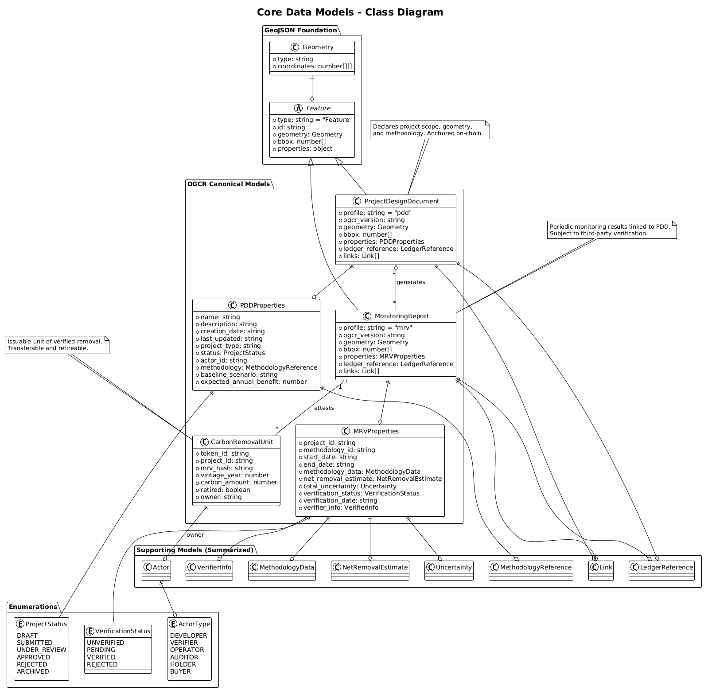

# OGCR API Specification

**Version:** 0.1.0  
**Date:** July 2025   
**Authors:** OGCR Consortium  
**Status:** Draft  
**License:** CC-BY 4.0

## Abstract

The OGCR API Specification defines a registry framework for carbon removal certification based on open geospatial standards and verifiable ledger integration. It specifies canonical data formats, lifecycle states, API interfaces, and blockchain anchoring methods for managing project design, monitoring, verification, and issuance of removal attestations. The specification builds upon GeoJSON [1], JSON Schema [2], and ERC-721 [3] to support traceable, interoperable, and auditable carbon removal systems consistent with the Carbon Removal Certification Framework (CRCF) and Regulation (EU) 2024/3012 [4].

## 1. Introduction

### 1.1 Purpose and Scope

This specification defines the functional and structural requirements for carbon removal registry systems. It establishes data formats, interface protocols, and lifecycle rules for managing project registration, monitoring, verification, and credit issuance. The framework is designed for interoperability with third-party systems, integration with public blockchains, and alignment with regulatory instruments such as the EU Carbon Removal Certification Regulation.

The scope includes data structures for project design documents (PDD), monitoring and verification reports (MRV), and certified removal units (CRU); conformance rules for state transitions; and patterns for cryptographic anchoring. Support is provided for multiple removal types, including land-based and industrial processes.

### 1.2 Design Principles

The specification is governed by five principles:

* **Minimality**: All data requirements SHALL support traceability, validation, and regulatory reporting, with no redundant fields.
* **Extensibility**: The data model and API structure SHALL accommodate evolving methodologies and domain-specific extensions.
* **Transparency**: All state changes SHALL be traceable, verifiable, and publicly inspectable.
* **Interoperability**: The specification SHALL conform to open standards to ensure compatibility with geospatial, registry, and blockchain systems.
* **Security**: Registry operations SHALL implement role-based access control and ensure cryptographic integrity of attestations.

### 1.3 Regulatory Context

This specification is intended to support implementation of Article 9 and Annexes I–III of Regulation (EU) 2024/3012 [4]. It addresses certification requirements for permanent carbon removals, carbon farming, and carbon storage in products. It specifies data fields and workflows necessary for compliance with monitoring, verification, additionality, permanence, and liability provisions. The architecture supports registry interoperability, auditability, and integration with national and international carbon accounting mechanisms.

## 2. System Architecture

### 2.1 Architectural Overview

A registry system conforming to this specification SHALL implement a three-layer architecture that separates interface logic, application state management, and verifiable state anchoring. Each layer SHALL be functionally distinct and interoperable with external systems and services.

*Figure 1: Reference system architecture defining application, API, and ledger layers.*

The **Application Layer** provides interfaces for human and machine actors. This includes web portals, mobile clients, and automated integrations. It SHALL support user interaction, identity delegation, and task coordination.

The **API Layer** exposes a RESTful interface for lifecycle operations on registry artifacts. It SHALL implement validation, access control, schema enforcement, and canonical serialization. It MAY coordinate with external services for verification or monitoring.

The **Blockchain Layer** maintains immutable references to registry state. It SHALL record document hashes, lifecycle events, and token-related actions. Ledger anchoring MUST be cryptographically verifiable and support independent audit.

### 2.2 Data Flow

A conforming implementation SHALL support structured data flows for project registration, monitoring, verification, and issuance. Each transition SHALL be deterministic, auditable, and linked to a canonical document reference.

**Project Registration** begins with the submission of a Project Design Document (PDD). The API layer SHALL validate schema conformance, methodology references, and geospatial footprint. Upon approval, a unique identifier SHALL be assigned and the document hash anchored on-chain.

**Monitoring and Verification** involves the submission of Monitoring, Reporting, and Verification (MRV) documents. These SHALL include quantified removals, methodology-specific inputs, and verifier attestations. Verified reports SHALL be linked to prior PDDs and recorded for audit and credit issuance.

**Credit Management** includes the creation, transfer, and retirement of carbon removal attestations. These SHALL be represented as cryptographically bound units (e.g., tokens), linked to verified removals and anchored for lifecycle traceability.

### 2.3 Integration Patterns

The specification defines standard integration patterns for registry federation, blockchain abstraction, and third-party system interoperability.

**Registry Federation** enables interoperability between multiple registry implementations. Federated systems SHALL prevent double counting, preserve provenance, and maintain cross-jurisdictional coherence.

**Blockchain Integration** SHALL support verifiable anchoring of document state and token issuance. The specification defines minimum on-chain data requirements, while allowing optimizations for gas efficiency, throughput, and chain-agnostic deployments.

**External System Integration** MAY include data providers, verifiers, or market actors. All integrations SHALL conform to standardized data schemas and authenticated communication protocols to ensure consistency and integrity.

## 3. Core Data Models

*Figure 4: UML class diagram of canonical document types and their relationships.*

This specification defines three canonical document types used to represent project declarations, monitoring results, and verified removal units. All core documents SHALL be serialized as GeoJSON Features [1] and SHALL follow schema constraints defined in the corresponding conformance classes.

### 3.1 Project Design Document (PDD)

The Project Design Document (PDD) defines the initial parameters of a carbon removal project. It SHALL contain project geometry, activity classification, actor identifiers, and methodological references. The PDD establishes the scope against which monitoring, verification, and issuance processes are evaluated.

Each PDD SHALL conform to the GeoJSON Feature model and SHALL include a valid `geometry` field representing the project boundary in WGS84 coordinates. The `properties` object SHALL contain required fields including project name, type, actor ID, and methodology reference.

PDDs SHALL reference approved methodologies that define quantification rules, monitoring requirements, and validation conditions. The PDD MAY include versioning metadata to track document evolution. Once validated, PDDs SHALL be immutable and anchored via cryptographic hash for audit purposes.

### 3.2 Monitoring, Reporting, and Verification (MRV)

The MRV document captures quantitative results from project monitoring and verification activities. Each MRV SHALL reference a single parent PDD and SHALL represent a defined monitoring period. Overlapping reporting periods for the same project SHALL be disallowed.

MRV documents SHALL include temporal coverage, methodology-specific inputs, calculated net removal values, and uncertainty estimates. Measurement types MAY include field observations, remote sensing outputs, or direct measurement instruments, subject to methodology compatibility.

Verification metadata SHALL be included for independently validated MRVs. This MAY contain verifier identity, accreditation ID, verification outcome, and date. Verified MRVs form the basis for issuance of removal attestations.

### 3.3 Carbon Removal Units (CRUs)

Carbon Removal Units (CRUs) represent attested net removals of CO₂ equivalent. Each CRU SHALL be linked to a validated MRV and a parent PDD, and SHALL correspond to a quantifiable and verifiable removal amount.

CRUs SHALL be uniquely identifiable and SHALL include metadata that binds them to the underlying monitoring and verification context. Implementations MAY use token-based representations such as ERC-721 for lifecycle tracking, transferability, and retirement.

CRUs MAY be issued in fractional quantities where permitted by the registry. Each unit SHALL retain a one-to-one mapping to its provenance data. Retired CRUs SHALL be excluded from transfer and SHALL be cryptographically flagged as withdrawn from circulation.

## 4. API Design

### 4.1 API Design Philosophy

The OGCR API defines a resource-oriented interface for managing registry artifacts and lifecycle operations. All endpoints SHALL conform to REST architectural constraints and SHALL operate over standard HTTP verbs (`GET`, `POST`, `PUT`, `DELETE`).

The API SHALL expose resource collections for projects, monitoring reports, and removal units. Each resource type SHALL implement a consistent set of operations for creation, retrieval, update (where allowed), and archival.

Implementations SHALL require only the minimum data necessary for conformance with the document schema and lifecycle rules. Optional fields MAY be used for extended functionality, provided they do not conflict with required validation logic.

Error responses SHALL follow a uniform structure, including HTTP status codes, machine-readable error identifiers, and human-readable messages. Validation errors SHALL include field-level annotations and reason codes.

The API interface, including endpoints, parameters, request/response structures, and authentication flows, SHALL be documented in a machine-readable format (e.g., OpenAPI). The documentation SHALL include example requests and expected responses for each operation.

### 4.2 Core API Endpoints

The OGCR API defines a set of resource-oriented endpoints for managing the lifecycle of registry documents and issued carbon removal units. Each endpoint group corresponds to a distinct functional process: project registration, monitoring and verification, and credit issuance and retirement.

All endpoints SHALL implement authenticated access, schema validation, and consistent response structures.

#### 4.2.1 Project Management

Project endpoints manage the creation, retrieval, update, and status tracking of carbon removal projects. A project is represented by a Project Design Document (PDD) and is associated with a unique identifier.

* **`POST /projects`**

  Submits a new project to the registry. The request body SHALL conform to the canonical PDD schema. The system SHALL validate document structure, methodology reference, and spatial geometry. Upon acceptance, a unique project identifier SHALL be issued and the PDD SHALL enter the `submitted` state.

*Figure 2: Project registration lifecycle, from submission to validation and anchoring.*

* **`GET /projects/{projectId}`**

  Retrieves the full project record, including document content, status, version history, and links to associated monitoring reports.

* **`PUT /projects/{projectId}`**

  Updates a project document prior to validation. After validation, modifications SHALL be restricted to permitted metadata fields (e.g., contact information). All changes SHALL be versioned and timestamped.

* **`GET /projects`**

  Returns a paginated list of project entries. Query parameters MAY include status, methodology, actor, bounding box, and creation or approval date ranges.

#### 4.2.2 Monitoring and Verification

Monitoring endpoints handle submission and retrieval of monitoring reports (MRVs). Verification endpoints manage the attestation process by authorized verifiers.

* **`POST /projects/{projectId}/monitoring`**

  Submits a monitoring report for the specified project. The report SHALL conform to the MRV schema and SHALL not overlap temporally with any existing MRV for the same project. The system SHALL validate schema conformance, reporting period boundaries, and methodology consistency.

*Figure 3: MRV submission, verification, and issuance process.*

* **`GET /projects/{projectId}/monitoring`**

  Returns monitoring reports associated with a project. Filtering options MAY include reporting period, verification status, or verifier identity.

* **`POST /projects/{projectId}/monitoring/{reportId}/verify`**

  Submits a verification decision. Only authorized verifiers MAY call this endpoint. The request SHALL include verification status, documented outcome, and the amount of verified removal in metric tonnes CO₂e. Upon acceptance, the system SHALL update the MRV status and trigger credit issuance logic.

#### 4.2.3 Credit Management

Credit endpoints manage the lifecycle of Carbon Removal Units (CRUs), from issuance through transfer and retirement. Each unit represents a verified quantity of net CO₂ removal.

* **`GET /credits`**

  Returns a list of issued CRUs. Query parameters MAY include project ID, issuance year, owner address, and retirement status.

* **`POST /credits/transfer`**

  Transfers one or more CRUs to a new account. The request MUST include identifiers for the units to be transferred and the recipient’s address. The system SHALL verify ownership, recipient eligibility, and transaction validity before completing the operation.

* **`POST /credits/{creditId}/retire`**

  Permanently retires a CRU. The request SHALL include the retirement reason and MAY include beneficiary or use-case metadata. Retired units SHALL become non-transferable and remain publicly traceable in the registry.

### 4.3 Authentication and Authorization

The OGCR API SHALL implement authentication and authorization mechanisms to control access to registry operations. Access control MUST be enforced at the interface, resource, and operation levels.

* **OAuth 2.0**

  SHALL be supported for authenticating human users and web-based clients. Supported flows SHALL include authorization code and client credentials. Access tokens SHALL define scoped permissions, restricting access to specific endpoints and operations.

* **API Keys**

  MAY be issued for server-to-server integrations or automated agents. Each API key SHALL be bound to an organization and associated with defined scopes and rate limits. Keys SHALL be revocable.

* **Role-Based Access Control (RBAC)**

  SHALL be used to restrict operations based on assigned roles. Core roles include `developer`, `verifier`, `operator`, and `holder`. Each role SHALL be associated with a defined set of permissions. The system SHALL validate role-based permissions on all sensitive operations.

All access attempts and authorization decisions SHALL be logged. Audit logs SHALL record timestamps, actor identity, resource identifiers, and outcome status. Logs MUST be available for inspection by authorized administrators.

### 4.4 Data Validation and Quality Assurance

All submitted documents and requests to the API SHALL be subject to multi-level validation to ensure schema compliance, business rule conformity, and data quality.

Registries implementing this specification SHOULD support validation dashboards and issue tracking interfaces to enable continuous improvement in submission accuracy and consistency.

#### 4.4.1 Schema Validation

Schema Validation SHALL be applied to all resource submissions. Each core document type (PDD, MRV) SHALL be validated against its corresponding JSON Schema ([PDD Schema](../schemas/pdd-schema.json) or [MRV Schema](../schemas/mrv-schema.json))

Validation SHALL include type checking, required fields, format constraints, and enumerated values. Error responses MUST reference the failing field and SHALL include human-readable correction guidance.

#### 4.4.2 Business Rule Validation

Business Rule Validation SHALL enforce constraints beyond schema structure, including:

  * Non-overlapping monitoring periods per project
  * Valid methodology reference and version
  * Non-intersecting project geometries
  * Role-based operation limits

These rules MAY be adapted based on jurisdictional or methodological requirements and SHALL be documented.

#### 4.4.3 Data Quality Assessment

MAY be applied to submitted documents. Quality indicators MAY include completeness, internal consistency, and adherence to reporting best practices. The registry MAY assign a non-normative quality score to each submission for reporting or review prioritization purposes.

### 4.5 Performance and Scalability

The OGCR API SHALL support scalable operation under variable load conditions. Implementations SHALL include mechanisms for performance optimization, fault tolerance, and efficient access to large datasets.

Implementations SHOULD monitor system performance and provide administrative access to runtime metrics for operational oversight.

#### 4.5.1 Caching

Responses to frequently accessed resources MAY be cached at the server or proxy level. Cache invalidation mechanisms SHALL ensure consistency with underlying registry state. Time-to-live (TTL) policies and conditional request headers (e.g., `ETag`) MAY be used.

#### 4.5.2 Pagination and Filtering

Collection endpoints SHALL support pagination. Offset-based pagination SHALL be supported by default; cursor-based pagination MAY be provided for large or real-time datasets. Query parameters for filtering and sorting by attributes (e.g., status, date, geography) SHALL be implemented to limit payload size and improve response performance.

#### 4.5.3 Asynchronous Operations

Time-intensive processes such as schema validation, verification submission, and ledger anchoring MAY be handled asynchronously. The initiating endpoint SHALL return a task identifier, and a separate status endpoint SHALL provide progress updates and final outcomes.

#### 4.5.4 Rate Limiting

The API SHALL enforce rate limits to manage resource usage. Limits MAY vary by role, client type, or endpoint category. When a rate limit is exceeded, the API SHALL return an HTTP 429 response with a `Retry-After` header.

## 5. Smart Contract Requirements

### 5.1 Smart Contract Architecture

The OGCR Specification defines requirements for smart contracts that SHALL provide immutable state anchoring, verifiable state transitions, and support for decentralized governance. The architecture SHALL follow modular design principles and MUST emit event logs for all critical operations.

#### 5.1.1 Modular Contract Design

Smart contract logic SHALL be separated into components with defined responsibilities. Each contract SHALL handle one core function: project registration, MRV anchoring, unit issuance, or access control. Contracts MAY be independently deployed and upgraded.

#### 5.1.2 Upgradeability

Implementations MAY use proxy patterns to enable logic upgrades. Upgrade mechanisms SHOULD include governance constraints such as delay periods, multi-signature authorization, or stakeholder voting. State variables MUST remain consistent across upgrades.

#### 5.1.3 Event Emission

All state-changing actions (e.g., registration, approval, issuance) MUST emit events. Events SHALL include sufficient metadata to support off-chain indexing, registry reconciliation, and external monitoring.

### 5.2 Core Contract Types

A conforming implementation SHALL deploy the following smart contract types. Each contract SHALL expose interfaces required for integration with the API and registry backend. Access to state-changing functions MUST be restricted to authorized roles.

#### 5.2.1 Project Registry Contract

The Project Registry Contract SHALL store immutable references to submitted project design documents and track project lifecycle status.

* **Registration**

  The contract SHALL accept project document hashes, unique identifiers, and metadata submitted by authorized actors. On success, the contract SHALL emit a `PDDRegistered` event.

* **Approval and Rejection**

  Validators MAY update project status by invoking approval or rejection functions. Each decision MUST be logged with a timestamp and validator address. Rejections MAY include justification metadata.

* **Status Transitions**

  Projects MAY transition through states including `draft`, `submitted`, `validated`, `rejected`, or `archived`. Each transition MUST be recorded via event emission.

*Figure 5: Valid state transitions for registered projects.*

Read access to project metadata and status MUST be publicly available. Write operations MUST be restricted to accounts with appropriate roles (e.g., `developer`, `validator`, `operator`).

#### 5.2.2 MRV Registry Contract

The MRV Registry Contract SHALL manage hashes and metadata for monitoring, reporting, and verification (MRV) records. Each MRV record MUST reference an approved project and a specific reporting period.

* **Submission**

  Authorized actors MAY submit monitoring report hashes along with associated metadata. The contract SHALL validate that the referenced project is approved and that the reporting period does not overlap with existing entries.

* **Verification**

  Authorized verifiers MAY record verification outcomes, including net removal quantities and dates. The contract MUST emit a `MRVVerified` event containing the MRV ID, verifier address, and quantified amount.

* **Hash Integrity**

  The contract SHALL store cryptographic hashes of each MRV report. Off-chain systems MAY verify report integrity by comparing content hashes to on-chain references.

Temporal constraints MUST ensure that monitoring reports do not overlap and that all periods align with project timelines and methodology requirements.

#### 5.2.3 Carbon Credit Token Contract

The Carbon Credit Token Contract SHALL represent Carbon Removal Units (CRUs) as non-fungible tokens (NFTs) conforming to the ERC-721 standard [3]. Each token MUST represent a verified quantity of carbon removal and MUST be traceable to its source MRV and project.

* **Minting**

  Only authorized actors MAY mint tokens. Each mint operation MUST reference a verified MRV, and the resulting token MUST include metadata fields for project ID, MRV ID, vintage year, and amount. A `CRUMinted` event MUST be emitted.

* **Transfer**

  Token holders MAY transfer tokens subject to registry rules. All transfers MUST be logged with timestamps and involved addresses. Optional restrictions MAY be applied based on regulatory constraints or credit type.

* **Retirement**

  Tokens MAY be retired to finalize a carbon offset claim. Retired tokens MUST be non-transferable and MUST retain all metadata for auditability. A `CRURetired` event MUST be emitted with a reason code.

Each token’s metadata structure SHALL include project identifiers, reporting period, carbon amount, issuance and retirement status, and any relevant compliance attributes.

#### 5.2.4 Access Control Contract

The Access Control Contract SHALL define and enforce role-based permissions across all smart contract components. It SHALL provide centralized role assignment and delegation, authorization enforcement, and support for multi-signature governance.

* **Role Management**

  The contract SHALL implement functions to assign, update, and revoke roles. Roles SHALL include at minimum:

  * `developer`
  * `verifier`
  * `registry_operator`
  * `administrator`

  Each role SHALL be associated with a predefined set of permissions. Role changes SHALL emit traceable events.

* **Authorization Logic**

  All state-changing functions across contracts SHALL invoke permission checks defined in the access control layer. Unauthorized calls SHALL revert. Authorization failures SHALL be logged.

* **Multi-Signature Operations**

  The contract MAY support multi-signature approval for selected administrative functions, including role assignment and contract upgrades. Thresholds SHALL be configurable and enforced at the contract level.

* **Emergency Controls**

  The contract MAY implement pause and recovery mechanisms. These SHALL be restricted to privileged roles and SHALL emit events recording the initiating actor and timestamp.

### 5.3 Integration Requirements

Smart contracts defined by this specification SHALL interoperate with off-chain registry systems. All on-chain actions affecting registry state SHALL emit events suitable for real-time or deferred processing.

#### 5.3.1 Event Monitoring

Off-chain components SHALL subscribe to contract events to maintain registry state. Event handlers SHALL implement error handling, deduplication, and retry logic. Events SHALL include sufficient metadata to reconstruct associated off-chain actions.

#### 5.3.2 State Synchronization

Registries SHALL implement synchronization mechanisms to resolve discrepancies between ledger and database state. Reconciliation procedures SHALL be invoked on failure or inconsistency. Blockchain reorganizations SHALL be accounted for.

#### 5.3.3 Gas Optimization

Contract functions SHALL be designed to minimize execution costs. Implementations MAY include batch operations and efficient data encoding. Computation-heavy tasks SHOULD be offloaded to the registry or avoided entirely.

#### 5.3.4 Network Compatibility

Contracts SHALL support deployment across multiple EVM-compatible networks. Network-specific parameters (e.g., gas limits, block time) SHALL be configurable. Interactions with external systems SHALL account for network constraints and finality assumptions.

### 5.4 Security Requirements

Smart contracts implementing this specification SHALL include controls to mitigate known vulnerabilities and ensure secure operation throughout their lifecycle. Security requirements apply to all contract modules and interfaces affecting registry state or token issuance.

#### 5.4.1 Access Control Validation

All externally accessible functions SHALL validate the caller's permissions prior to execution. Role-based access control MUST be enforced consistently. Critical operations MAY include multi-signature thresholds. Emergency pause and recovery functions SHALL be restricted to privileged roles.

#### 5.4.2 Input Validation

Contracts SHALL validate input parameters for type, range, and expected state conditions. This includes protection against arithmetic overflows, zero-value identifiers, and inconsistent internal state. Inputs affecting identifiers, timestamps, or transfer amounts MUST be explicitly checked.

#### 5.4.3 Reentrancy Protection

Contracts SHALL prevent reentrancy by applying function modifiers or the checks-effects-interactions pattern. Functions that modify contract state and initiate external calls MUST implement explicit reentrancy guards.

#### 5.4.4 Upgrade Security

If upgradeable proxy patterns are used, upgrade operations SHALL be protected by governance procedures. These MAY include time-locked execution, multi-party approval, and audit checkpoints. Migration functions MUST ensure state continuity and prevent unauthorized access.

#### 5.4.5 Audit and Verification

All contract modules affecting issuance, registry status, or state transitions SHALL undergo security review prior to deployment. Audit processes MAY include:

* Static analysis
* Manual code review
* Test coverage reporting
* Formal verification (where applicable)

Audits SHALL be repeated after any material change to contract logic. Results SHOULD be published where transparency is required by the registry governance policy.

## 6. Extensibility Framework

The specification defines a modular extensibility framework that allows registry systems to incorporate new carbon removal methodologies without altering the core protocol. Methodologies MAY define custom rules for monitoring, quantification, and validation, provided they conform to the interface and schema extension mechanisms defined below.

### 6.1 Methodology Extension System

This specification supports the use of versioned methodologies to define quantification logic, input requirements, validation procedures, and conformance rules for carbon removal activities.

The process of introducing, modifying, or approving methodologies SHALL be subject to registry-level governance, as defined in Section 6.3. In regulated environments, methodology approval SHALL conform to applicable legal frameworks, including Article 8 of Regulation (EU) 2024/3012. The governance process MAY involve public consultation, expert review, or delegated authority.

#### 6.1.1 Methodology Registration

Each methodology SHALL be registered with a globally unique identifier, semantic version string, list of supported project types, and references to applicable monitoring protocols and calculation procedures.

Only registered methodologies MAY be referenced in PDD or MRV documents. Revisions to a methodology that affect validation, calculation, or conformance SHALL result in a new version. A registry MAY impose governance review or approval conditions prior to activation or publication of a methodology.

#### 6.1.2 Schema Extension

Registered methodologies MAY extend the core schemas for PDD and MRV documents using [JSON Schema composition](https://json-schema.org/understanding-json-schema/structuring.html). Extensions SHALL NOT override or remove any required fields defined in the base schema. All additional fields SHALL be namespaced to avoid naming collisions and SHALL maintain backward compatibility.

#### 6.1.3 Validation Plugin Architecture

Methodologies MAY include executable validation logic. Plugins SHALL operate in isolated environments and SHALL accept only document inputs and associated metadata. Plugins SHALL return a machine-readable validation result and SHALL NOT modify registry state or access external resources.

Plugin deployment MAY be subject to governance approval. All plugin logic SHALL be version-controlled and auditable.

#### 6.1.4 Calculation Engine Integration

Methodologies MAY delegate quantification to an external calculation engine that implements a deterministic input/output contract. Engines SHALL accept structured monitoring data and produce a net removal estimate with associated uncertainty bounds.

Calculation logic SHALL be transparent and reproducible. Registries MAY cache, inspect, or independently verify outputs. Governance policies MAY define procedures for engine registration, audit, or revocation.

### 6.2 Integration Extension Points

The specification defines extension points for interoperating with external systems and services. These extension points SHALL enable integration without altering core registry logic or compromising data integrity.

#### 6.2.1 Data Source Connectors

Connectors MAY be implemented to ingest data from external sources, including satellite imagery, IoT sensors, and third-party monitoring platforms. Each connector SHALL support:

* Authenticated data retrieval
* Format transformation to registry-compliant structures
* Provenance tracking and timestamp preservation

Connectors SHALL NOT modify core registry data. Data received via connectors SHALL be treated as input to monitoring or validation processes.

#### 6.2.2 Verification Service Integration

Verification workflows MAY be delegated to accredited third-party services. The registry SHALL support:

* Verifier identity resolution and credential validation
* Submission and retrieval of verification documents
* Recording of outcomes with audit references

Verification services SHALL operate independently of project developers and SHALL comply with applicable role-based access controls.

#### 6.2.3 Federated Platform Integration

Registries MAY expose endpoints for integration with trading platforms, offset marketplaces, and federation networks. Market-facing interfaces SHALL include:

* Access to certified unit metadata
* Traceability to originating MRV and PDD
* Status updates reflecting transfer, retirement, or revocation

Federated registries SHALL implement conflict prevention mechanisms to avoid duplicate issuance or double use.

#### 6.2.4 Regulatory Reporting Integration

Registry systems MAY support automated reporting to public or private compliance authorities. Reporting interfaces SHALL enable:

* Data export in regulatory-compliant formats
* Schedule-based or event-based submission
* Confirmation logging and delivery status tracking

Personal and sensitive data submitted to regulatory bodies SHALL be protected in accordance with applicable legal requirements.

### 6.3 Governance Extension Framework

The Governance Extension Framework defines optional mechanisms that MAY be implemented by registry operators to support structured participation, oversight, and transparency. It enables stakeholder engagement in operational and methodological decision-making, while preserving the integrity of the core specification.

This extension does not modify conformance classes, document schemas, or defined lifecycle transitions. It applies only to registry-level governance processes that operate within the normative boundaries of this specification.

#### 6.3.1 Scope and Limitations

Governance extensions MAY be used to manage:

* Proposals for methodology additions or updates
* Operational policy decisions (e.g., audit frequency, data disclosure rules)
* Verifier accreditation, registry service provider oversight, or stakeholder participation
* Controlled adoption of new specification versions or optional modules
* Dispute resolution, audit response, and compliance enforcement

They SHALL NOT override:

* Canonical document structures (PDD, MRV, CRU)
* Defined lifecycle transitions or validation logic
* Hashing, anchoring, and reconciliation procedures
* Specification-level conformance rules

#### 6.3.2 Governance Procedures

A registry implementing this extension MAY define one or more of the following procedures:

* **Proposal System**

  Registries MAY implement a structured process for submitting and evaluating governance or methodology proposals. Proposals SHOULD include an impact assessment, implementation plan, and record of stakeholder consultation.

* **Voting Mechanisms**

  Where applicable, proposals MAY be subject to stakeholder voting. Voting systems SHALL define eligibility, quorum thresholds, voting weights (if applicable), and time limits. Results SHALL be recorded and implemented according to predefined rules.

* **Advisory Committee Integration**

  Registries MAY establish advisory committees to provide technical or policy guidance. Procedures for committee formation, member selection, meeting management, and recommendation tracking SHALL be documented.

* **Audit and Compliance Framework**

  Registries MAY define independent audit mechanisms for registry operations, certification workflows, or governance decisions. Audit procedures SHALL include scope definitions, auditor selection criteria, and result publication requirements.

All governance activities SHALL be documented and made available for public or regulatory inspection, as appropriate to the operating context.

### 6.4 Technical Extension Architecture

The Technical Extension Architecture defines optional implementation-level extension points that MAY be used to enhance registry functionality. Extensions SHALL operate outside the normative scope of this specification and SHALL NOT alter core document models, state transitions, or conformance logic.

Extensions MAY be used to support observability, non-canonical API functions, registry-specific workflows, and internal tooling. Implementations SHALL ensure that all extensions are isolated from core protocol logic and SHALL maintain compatibility with conformance rules.

#### 6.4.1 Plugin Interface

Registries MAY support a plugin interface for loading modular components such as internal jobs, visualization tools, or secondary data processors. Plugins SHALL operate in isolated environments and SHALL communicate only through defined interfaces. Resource constraints and execution boundaries SHALL be enforced.

#### 6.4.2 API Extension Layer

Implementations MAY expose additional API endpoints beyond those defined in the core specification. These endpoints SHALL be clearly documented and SHALL NOT conflict with canonical routes. Extensions MAY include authentication, rate limiting, and monitoring integration.

#### 6.4.3 Supplemental Data Schemas

Registries MAY extend internal database schemas to support additional metadata or analytic structures. Extended schemas SHALL maintain referential integrity with canonical identifiers and SHALL not affect lifecycle decisions or hashing logic. Schema extensions SHOULD follow migration and indexing procedures consistent with registry stability requirements.

#### 6.4.4 Observability Integration

Monitoring and alerting systems MAY be extended to support registry-specific metrics, dashboards, and threshold-based alerts. These extensions SHALL operate alongside core observability components and MAY support domain-specific visualizations, e.g., for methodology categories or verification throughput.

This extension architecture is intended to support operational flexibility and system-specific enhancements without compromising interoperability, auditability, or specification compliance.

## References

[1] RFC 7946: The GeoJSON Format. https://tools.ietf.org/html/rfc7946  
[2] JSON Schema Specification. https://json-schema.org/  
[3] ERC-721: Non-Fungible Token Standard. https://eips.ethereum.org/EIPS/eip-721  
[4] Regulation (EU) 2024/3012 establishing a Union certification framework for permanent carbon removals. https://eur-lex.europa.eu/eli/reg/2024/3012/oj
